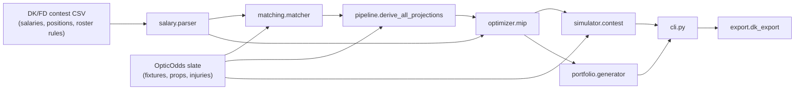

# NCAAF DFS EV Optimizer -- module reference

## Pipeline

| Stage | Module | Responsibility |
|---|---|---|
| CSV import | `dfs_ev/salary/parser.py` | Parses the DK/FD contest CSV into a `ContestFormat` (salary cap, roster slots, players). Roster slot *names* and *counts* come from the CSV itself (an explicit slot-template row when present, DK's fixed 1-CPT+5-FLEX convention for Showdown, or a best-effort per-token inference for Classic) -- never hard-coded CFB rules. |
| Name matching | `dfs_ev/matching/matcher.py` | Fuzzy-matches DK/FD player names against the OpticOdds player list (name + team, confidence-scored), with a manual alias CSV override and a needs-review queue for low-confidence matches. |
| Scoring | `dfs_ev/scoring/ncaaf_dk.py` | DK CFB Classic/Showdown scoring config (distinct from DK's NFL scoring) and a raw-stat-line -> fantasy-points converter. |
| Projections | `dfs_ev/projections/` | `odds_math.py` converts American odds to implied probability (with vig removal); `derive.py` turns a prop line + price into a stat-level projection, converts it to fantasy points via the scoring config, and implements the 4-tier fallback chain (user CSV -> OpticOdds prop -> salary-rank/team-total heuristic -> flagged "no projection") plus the ownership proxy. |
| Glue | `dfs_ev/pipeline.py` | Wires slate -> matching -> game environments -> projections -> injury adjustments, shared by the `match`/`optimize`/`simulate` CLI commands and the integration test. |
| Optimizer | `dfs_ev/optimizer/mip.py` | OR-Tools CP-SAT MIP: salary cap, roster slots (from the CSV), CPT/FLEX mutual exclusivity and 1.5x points, per-team rules, locks/bans, an optional QB+pass-catcher stack bonus, and iterative solution-forbidding for top-K distinct lineups. |
| Simulator | `dfs_ev/simulator/` | `montecarlo.py` runs a Numba-accelerated (or NumPy fat-tailed) correlated Monte Carlo score simulation with a shared per-fixture/per-team "game shock" and CFB blowout/FCS-mismatch variance adjustment; `contest.py` samples an ownership-weighted field, applies a payout curve (cash/GPP/balanced presets), and computes EV/ROI/ITM%/percentiles. |
| Portfolio | `dfs_ev/portfolio/generator.py` | Builds a diversified multi-lineup GPP portfolio from the optimizer's candidate pool, enforcing exposure caps, per-team caps, lineup-overlap caps, and (Showdown) captain-exposure caps. |
| Export | `dfs_ev/export/dk_export.py` | Writes lineups back out in the DK/FD upload-template shape (one column per roster slot). |
| OpticOdds client | `dfs_ev/opticodds/client.py` | Async httpx client for OpticOdds API v3 with a SQLite response cache (`opticodds/cache.py`), ID/sportsbook batching (<=5 each per `/fixtures/odds` call), a sliding-window rate limiter, and a soft per-slate call budget. |
| CLI | `dfs_ev/cli.py` | `slate pull`, `import`, `match`, `optimize`, `simulate`, `export`, `backtest`. Runs persist to SQLite (`dfs_ev/db.py`) so `simulate`/`export` can resume an `optimize` run by id. |

## Data-source boundaries

- **DK/FD contest CSV**: authoritative for salaries, positions, roster
  slots, the eligible player pool, and the CPT multiplier. Never
  overridden by OpticOdds.
- **OpticOdds API v3**: authoritative for odds, props, game environment,
  injuries, and historical results. Provides **no** salaries and **no**
  DFS ownership -- ownership is a documented proxy derived from
  projection-per-salary rank within position (see
  `projections.derive.ownership_proxy`), overridable by a user CSV.

## Known limitations / what to verify before real-money use

- **DK CFB scoring values** (`scoring/ncaaf_dk.py`) were set from
  well-known DK CFB rules, but this build environment has no outbound
  path to draftkings.com to re-verify at build time -- confirm against
  DK's live CFB rules page before trusting real projections.
- **OpticOdds sample data** (`data/sample_opticodds/ncaaf_week1_sample.json`)
  is this project's own normalized schema, not a captured real API
  response (same network restriction). `slate.load_live_slate` best-effort
  parses the real v3 `{"data": [...]}` envelope shape; re-check field names
  against your account's actual responses.
- **Field simulation** is a lightweight, ownership-weighted sample (not a
  fully salary-legal lineup per field entrant) scaled to the contest size
  -- good for relative EV/ROI comparisons between candidate lineups, not a
  precise real-money payout forecast.
- **FanDuel parsing** shares the DK code path with column-name aliasing
  and is less exercised than DK (the bundled sample CSV is DK Showdown).
