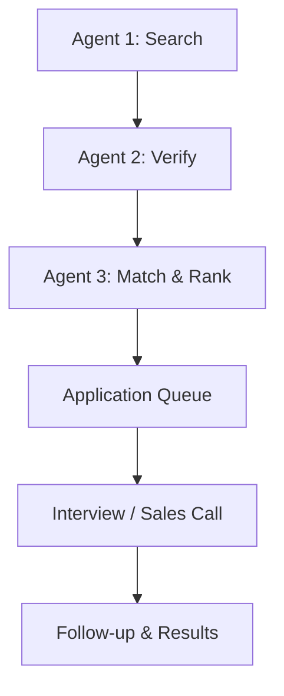

# Multi-Agent Application Flow

| Stage | Module | Responsibility |
|---|---|---|
| Agent 1: Search | `trend2success/agents/search_agent.py` | Pull raw listings from one or more pluggable sources. |
| Agent 2: Verify | `trend2success/agents/verify_agent.py` | Reject malformed, incomplete, or duplicate listings. |
| Agent 3: Match & Rank | `trend2success/agents/match_rank_agent.py` | Score verified listings against a `CandidateProfile` and rank them. |
| Application Queue | `trend2success/queue_store.py` | Persist the top-ranked listings as `Application` records (JSON-file backed). |
| Interview / Sales Call | `trend2success/interview.py` | Schedule the next live touchpoint for a queued application. |
| Follow-up & Results | `trend2success/followup.py` | Record the outcome after the interview/sales call and close out the application. |

`trend2success/pipeline.py` wires the first four stages (Search → Verify → Match & Rank →
Application Queue) into a single `Pipeline.run()` call. Interview scheduling and follow-up
are exposed as separate steps since they depend on real-world events that happen after
the pipeline runs, not synchronously with it.
