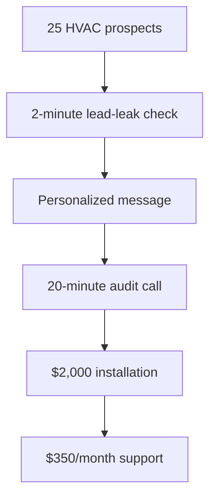

# HVAC Sales Funnel



| Stage | Module | Responsibility |
|---|---|---|
| 25 HVAC prospects | `trend2success/hvac/prospect_source.py` | Pull raw leads from one or more pluggable sources. |
| 2-minute lead-leak check | `trend2success/hvac/lead_leak_agent.py` | Flag prospects whose old or oversized energy bill signals a system likely wasting money. |
| Personalized message | `trend2success/hvac/message_agent.py` | Draft outreach copy for each flagged prospect, referencing the specific leak signal found. |
| 20-minute audit call | `trend2success/hvac/audit_scheduler.py` | Schedule the on-site audit for prospects who were messaged. |
| $2,000 installation | `trend2success/hvac/installation.py` | Close the deal after a completed audit call. |
| $350/month support | `trend2success/hvac/support.py` | Enroll a newly installed customer into recurring support. |

`trend2success/hvac/pipeline.py` wires the first three stages (25 HVAC prospects ->
lead-leak check -> personalized message) into a single `HVACFunnel.run()` call, backed by
`trend2success/hvac/lead_store.py`, a JSON-file-backed store that tracks each prospect's
status as it moves through the funnel. The audit call, installation, and support stages
are exposed as separate steps since they depend on real-world events (a call happening,
a deal closing) that happen after the pipeline runs, not synchronously with it.

## Run it

```bash
python -m trend2success.hvac.main
```

This pulls 25 sample HVAC prospects, runs the lead-leak check, and prints the
personalized messages sent to the prospects that were flagged.
