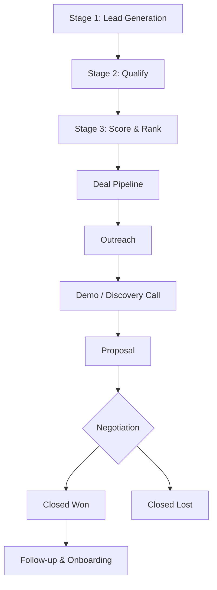

# Sales Funnel



| Stage | Module | Responsibility |
|---|---|---|
| Lead Generation | `trend2success/sales/agents/lead_gen_agent.py` | Pull raw leads from one or more pluggable sources. |
| Qualify | `trend2success/sales/agents/qualify_agent.py` | Reject leads missing contact info, a valid email, budget, or that are duplicates (BANT-style gate). |
| Score & Rank | `trend2success/sales/agents/score_rank_agent.py` | Score qualified leads against an `ICPProfile` (industry fit, keyword fit, budget/company-size thresholds) and rank them. |
| Deal Pipeline | `trend2success/sales/deal_store.py` | Persist the top-ranked leads as `Deal` records (JSON-file backed CRM), tracked through `DealStage`. |
| Outreach | `trend2success/sales/outreach.py` | Send the initial touch (email/call/LinkedIn) to a qualified deal, moving it to `contacted`. |
| Demo / Discovery Call | `trend2success/sales/demo.py` | Schedule the discovery call or product demo for a contacted deal. |
| Proposal & Negotiation | `trend2success/sales/closing.py` | Send the proposal, track back-and-forth negotiation. |
| Closing | `trend2success/sales/closing.py` | Record the won/lost outcome and deal value. |
| Follow-up & Onboarding | `trend2success/sales/followup.py` | Record the post-sale outcome for a won deal and move it into onboarding. |

`trend2success/sales/pipeline.py` wires the first three stages (Lead Generation → Qualify →
Score & Rank) into a single `SalesPipeline.run()` call that queues deals into the pipeline
at stage `qualified`. Outreach, demo scheduling, closing, and follow-up are exposed as
separate steps since they depend on real-world events (a rep sending an email, a prospect
taking a call, a contract getting signed) that happen after the pipeline runs, not
synchronously with it — the same pattern used by `trend2success/pipeline.py` for the
job-application flow.

## Deal stages

`new → qualified → contacted → demo_scheduled → proposal_sent → negotiation →
closed_won | closed_lost → onboarded`

## Run it

```bash
python -m trend2success.sales.main \
  --query automation \
  --name "Mid-Market SaaS" \
  --industries "SaaS,Retail" \
  --keywords "crm,automation,loyalty" \
  --min-budget 20000 \
  --top-n 5
```

This runs Lead Generation → Qualify → Score & Rank using the built-in sample data source,
and writes queued deals to `data/deal_pipeline.json`. To swap in a real data source
(a CRM export, a scraper, an ads/forms webhook), pass a custom source function to
`LeadGenAgent`, the same way `SearchAgent` accepts one:

```python
from trend2success.sales.agents import LeadGenAgent
from trend2success.sales.pipeline import SalesPipeline

def my_source(query: str):
    ...  # return a list[Lead] from a real CRM/forms/ads API

pipeline = SalesPipeline(lead_gen_agent=LeadGenAgent(sources=[my_source]))
```

## Driving a deal from outreach to close

```python
from trend2success.sales.deal_store import DealStore
from trend2success.sales.outreach import OutreachAgent
from trend2success.sales.demo import DemoScheduler
from trend2success.sales.closing import ClosingAgent
from trend2success.sales.followup import FollowUpAgent

store = DealStore("data/deal_pipeline.json")

OutreachAgent(store).run()                    # qualified -> contacted
DemoScheduler(store).schedule()                # contacted -> demo_scheduled
closing = ClosingAgent(store)
closing.send_proposal()                        # demo_scheduled -> proposal_sent
closing.close(deal_id, outcome="won", value=48000)  # -> closed_won
FollowUpAgent(store).record(deal_id, outcome="onboarding_scheduled")  # -> onboarded
```
